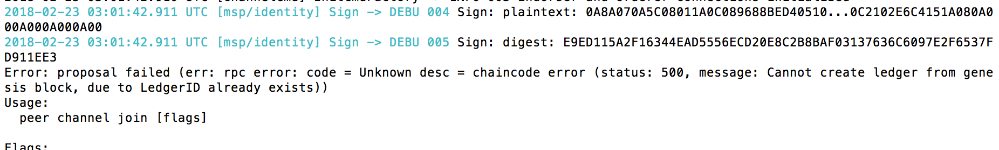

Troubleshooting
===============

* Always start your network fresh. Use the script `deleteNetwork.sh` to delete any pre-existing jobs/pods etc.

* If you see below error, then environment is not set properly and therefore kubectl commands will not work.
  ```
  $ kubectl get pods
  The connection to the server localhost:8080 was refused - did you specify the right host or port?
  ```

* If you see the below error,

  
  
  There is something wrong with the setup. You would like to do setup from a fresh.
  
* For debugging purposes, if you want to inspect the logs of any container, then run the following command.

  ```
   $ kubectl get pods --show-all                  # Get the name of the pod
   $ kubectl logs [pod name]                      # if pod has one container
   $ kubectl logs [pod name] [container name]     # if pod has more than one container
  ```