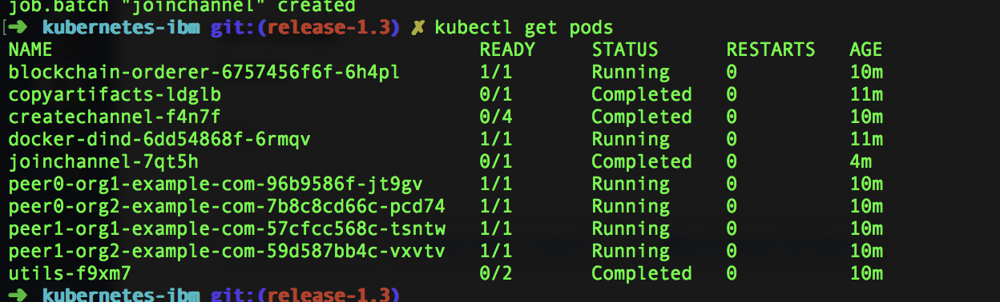
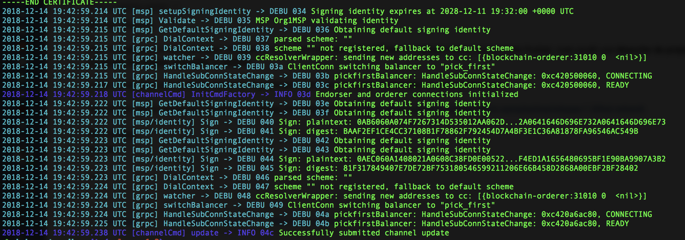
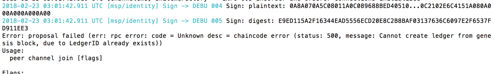

# Build Your First Network on Kubernetes using Minikube.

## Problem definition

So first, we need to define exactly what we want to do, why and how it diverge from the tutorial.

Minikube is a tool that makes it easy to run Kubernetes locally. 
Minikube runs a single-node Kubernetes cluster inside a VM on your laptop for users looking to try out Kubernetes or develop with it day-to-day. 
On mac, it can be installed using the docker client, the installation guide is available [here](https://docs.docker.com/docker-for-mac/#kubernetes).

Hyperledger Fabric is a blockchain framework implementation. 
Hyperledger Fabric provides a modular architecture, which allows components such as consensus and membership services to be plug-and-play. 
Hyperledger Fabric is allowing entities to conduct confidential transactions without passing information through a central authority. 
This is accomplished through different channels that run within the network, as well as the division of labor that characterizes the different nodes within the network. 
Lastly, Hyperledger Fabric supports permissioned deployments.
A good introduction of the architecture is available on Edx, LFS171x chapter 9.

### Why
We want to improve the development tooling and processes and increase collaboration between data scientists, software developers, and quality engineers.
To do so, we want to provide **an easy way to run Hyperledger Fabric on a laptop**.

### What
At the end of this exercice, we should be able to : 
* build a Hyperledger Fabric network on a clean machine (equivalent of docker-compose up --build)
* up and down the network at will (equivalent of docker-compose up|down)
* clean the environment and all the associated data (equivalent of docker-compose down -v)

### How
We need to adapt the tutorial available in the repo to run on kubernetes (its currently running with docker-compose with a lot of [prerequisites](https://hyperledger-fabric.readthedocs.io/en/release-1.3/prereqs.html#prerequisites)). 
As a squeleton, we can use an the amazing sample provided by IBM [here](https://github.com/IBM/blockchain-network-on-kubernetes) for hyperledger v1.2.1.
The goal is to follow step by step the tutorial available [here](https://hyperledger-fabric.readthedocs.io/en/release-1.3/build_network.html#).

## tasks
* [✔️] Run and fix the IBM tutorial
    - [✔️] Fix "Waiting for container of copy artifact pod to run" when pod already succeeded
    - [✔️] First issue, the cryptogen container can't chmod on the /shared folder.
* [IN PROGRESS] Migrate configuration from docker-compose to kubernetes
    - [✔️] Copy artifacts
    - [✔️] Improve generate artifacts
    - [✔️] Modify blockchain-services.yaml (Setup 2 peers per Org)
    - [✔️] Modify peersDeployment (Start 2 peer for Org 1 and 2)
    - [✔️] Modify create_channel (Create a Channel Configuration Transaction and Create channel)
    - [✔️] Join the channel
    - [✔️] Update the anchor for org 1
    - [TODO] Join channel with peer0org2 and set anchor for org2
    - [TODO] Enable TLS (set ORDERER_GENERAL_TLS_ENABLED=true)
* [TODO] Install & Instantiate Chaincode
* [TODO] Expose UI for hyperledger
* [TODO] Add kubernetes monitoring and alerting
    
## Run

Install kubernetes and kubectl.

```bash
## macOS
sed -i '' s#unix:///host/var/run/docker.sock#tcp://docker:2375# configFiles/peersDeployment.yaml

## Linux
sed -i s#unix:///host/var/run/docker.sock#tcp://docker:2375# configFiles/peersDeployment.yaml

chmod +x setup_blockchainNetwork.sh
./setup_blockchainNetwork.sh
```

### Result

At the end of the process, you should end up with the following pods : 


Here is the last log from the pod in charge of updating the anchor peer:


## Clean

```bash
chmod +x deleteNetwork.sh
./deleteNetwork.sh
```

## Troubleshooting

* Always start your network fresh. Use the script `deleteNetwork.sh` to delete any pre-existing jobs/pods etc.

* If you see below error, then environment is not set properly and therefore kubectl commands will not work.
  ```
  $ kubectl get pods
  The connection to the server localhost:8080 was refused - did you specify the right host or port?
  ```
  
  please follow this [guide](https://kubernetes.io/docs/tasks/tools/install-kubectl/).

* If you see the below error,

  
  
  There is something wrong with the setup. You would like to do setup from a fresh.
  
* For debugging purposes, if you want to inspect the logs of any container, then run the following command.

  ```
   $ kubectl get pods --show-all                  # Get the name of the pod
   $ kubectl logs [pod name]                      # if pod has one container
   $ kubectl logs [pod name] [container name]     # if pod has more than one container
  ```
